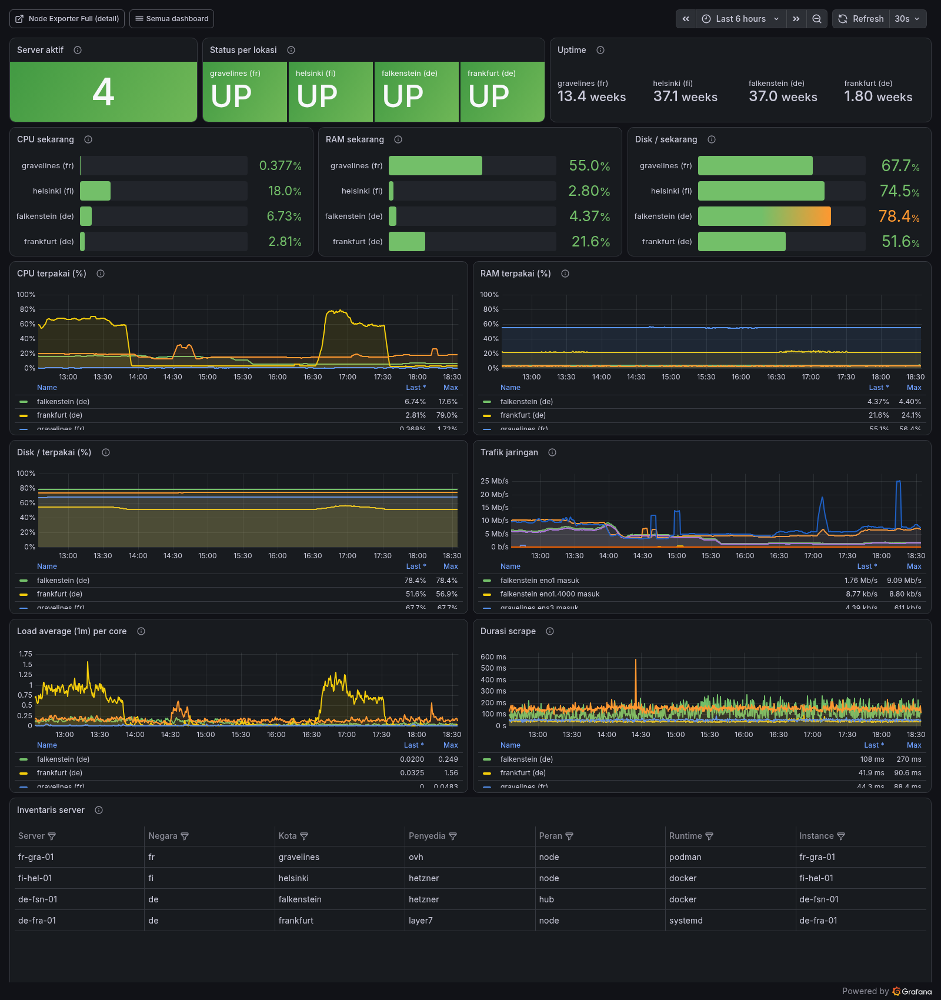
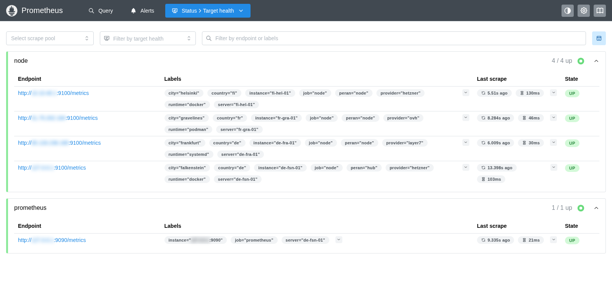
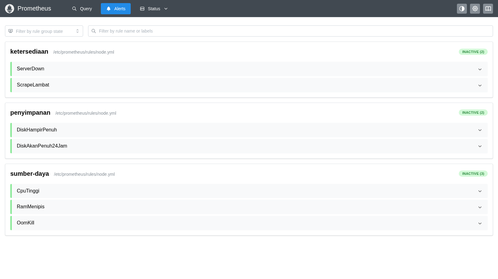

# my-monitoring-setup

How I ended up monitoring four servers across three providers with
Prometheus and Grafana — what I built, what I got wrong, and what
it looks like now.

This is a write-up, not a product. The configs are here as
evidence for the text rather than something to clone. Every
address has been replaced with a `<PLACEHOLDER>`.



> Screenshots are from my own running instance.

---

## What I started with

Four servers that had nothing in common:

| | Provider | Location | What was on it |
|---|---|---|---|
| hub | Hetzner | Falkenstein | Docker, already running other things |
| node-b | Hetzner | Helsinki | nothing — and **no public IPv4** |
| node-c | OVH | Gravelines | Podman, and the only account had UID 0 |
| node-d | Layer7 | Frankfurt | completely bare, no container runtime |

Plus a handful of short-lived VMs at UpCloud and Linode that get
created and destroyed, which I also wanted to see.

I wanted one place to look at all of them. Nothing more ambitious
than that.

## What I built

```
                      HUB
                       │
  Grafana :3000 ──────▶ Prometheus :9090      30d retention
                       │   └── scrapes ──▶ node_exporter ×4
                       │
                   Prometheus :9091          7d retention
                       ▲
                 remote_write
                       │
      nginx (basic auth, POST /api/v1/write only)
                       ▲
            agent on each ephemeral server
```

Two models, because the two kinds of server have genuinely
different needs:

**Fixed servers — Prometheus pulls.** It fetches `/metrics` from
each host. Only the nodes open a port, and only to the hub's
address.

**Ephemeral servers — the server pushes.** It runs a small agent
that sends metrics outward. Nothing is opened anywhere, no SSH key
is left behind, nothing registers with the hub. That is what makes
it work at any provider, including behind NAT.

Prometheus and Grafana listen on `127.0.0.1` only. What faces the
internet is a reverse proxy.

## Four ways to run node_exporter

I did not set out to collect methods. Each machine simply needed
something different, and comparing them afterwards turned out to
be the most interesting part of the whole exercise.

### Docker — `node-docker/`

The obvious one. The thing worth noting is that I do **not**
publish the port:

```yaml
network_mode: host
command:
  - '--web.listen-address=10.10.40.1:9100'
```

Host networking, bound to a private address. Reasons in
[Docker punches through UFW](#docker-punches-through-ufw).

### Podman rootful + Quadlet — `node-podman/`

Quadlet is the part I had not used before. You write a 20-line
`.container` file; on `systemctl daemon-reload`, systemd
*generates* a real `.service` unit from it.

```
Loaded: loaded (/etc/containers/systemd/node-exporter.container; generated)
CGroup: /system.slice/node-exporter.service
        └─ /bin/node_exporter --path.rootfs=/host ...
```


The word `generated` on the `Loaded:` line is systemd saying it
invented this unit. And the cgroup holds the **actual**
node_exporter process. With Docker, that cgroup sits under
`docker.service` and systemd knows nothing about what is inside.
No daemon in between.

I had wanted rootless here. The only account on that box has UID 0
and `/etc/subuid` is empty, so rootless was not possible without
creating a new user. Rootful Quadlet still gets you the
no-daemon property, just not the unprivileged one.

### Binary + systemd — `node-systemd/`

A bare machine. Installing a container daemon for one process made
no sense, so: one static binary, one systemd unit, one system user
with no shell.

What replaces container isolation is systemd hardening —
`ProtectSystem=strict`, `NoNewPrivileges`,
`MemoryDenyWriteExecute`, and friends. node_exporter only ever
needs to read.

What the other three cannot easily have:

```
--collector.systemd
```

Unit state becomes a metric, so a *failed* service shows up on its
own. The first time I enabled it, it immediately surfaced a
service that had been dead for an unknown length of time on
another host. In a container this needs host D-Bus access; here it
is one flag.

### Push agent — `node-ephemeral/`

For hosts that exist for a day. One command, and the only thing I
have to supply is a token:

```bash
bash bootstrap.sh --push-pass 'TOKEN'
```

Provider, country and city are detected through a chain: DMI →
reverse DNS → cloud metadata → geo-IP. `--dry-run` shows what it
concluded without touching anything.

The server names itself after its public IP. For short-lived
hosts that beats sequential numbering: unique with no
coordination, no race when several boot at once, and immediately
usable to SSH in.


## Adding a server

The folders are named after the **method**, not the machine —
there are only four methods, and that number does not grow when
servers do. Adding a fifth, sixth or seventh Docker node adds no
folder at all.

Everything that differs between hosts lives in a `.env` next to
the scripts. The scripts themselves are byte-identical on every
host using that method:

```
repo                          each host gets a copy
node-docker/
├── docker-compose.yml  ──┬─▶ node-b:/opt/monitoring/  + its own .env
├── ufw.sh              ──┼─▶ node-e:/opt/monitoring/  + its own .env
├── install-docker.sh   ──┘   node-f:/opt/monitoring/  + its own .env
└── .env.example
```

Three Docker hosts, three `.env` files, one `docker-compose.yml`:

```bash
# node-b — has a private link to the hub
LISTEN_ADDR=10.10.40.1:9100     # private address only
ALLOW_FROM=10.10.40.2
VLAN_IFACE=eno1.4000

# node-e — ordinary public IP
LISTEN_ADDR=:9100
ALLOW_FROM=<HUB_IPV4>
VLAN_IFACE=

# node-f — public IP at another provider
LISTEN_ADDR=:9100
ALLOW_FROM=<HUB_IPV4>
VLAN_IFACE=
```

node-b binds to a private address while the others bind to all
interfaces. That difference is now data, not a code branch.

So adding a server is three steps, and stays three steps:

1. **One line in `inventory.env`**
2. **One target block in `hub/prometheus/prometheus.yml`** — this
   is where servers genuinely differ, in their labels
3. **Run the right method folder's scripts on the new host**

```bash
ssh <host> 'mkdir -p /opt/monitoring'
scp -O node-docker/{docker-compose.yml,ufw.sh} <host>:/opt/monitoring/
ssh <host> 'cd /opt/monitoring && cp .env.example .env && vi .env'
ssh <host> 'cd /opt/monitoring && docker compose up -d && bash ufw.sh'
```

Dashboards and alert rules are not touched. They filter on
`job="node"` and on labels, never on an address — which is why
the fourth server appeared complete in every panel the moment its
target block was added.

When fixing something later, one `scp` loop updates every host of
that type. That is impossible when each server has its own folder
holding its own values.

### When step 2 disappears too

Somewhere around eight to ten servers, hand-editing
`static_configs` starts to grate. That is the point to switch to
`file_sd_configs`: Prometheus watches a directory, and adding a
server means dropping a JSON file into it — no config edit, no
reload.

Worth doing when you reach it, not before. Four servers are
comfortable by hand.

## Keeping the two apart

The separator is the **job name**, and that choice paid for itself
repeatedly.

| | Fixed | Ephemeral |
|---|---|---|
| job | `node` | `node-ephemeral` |
| Prometheus | `:9090`, 30 days | `:9091`, 7 days |
| Grafana folder | Infrastructure | Ephemeral |

Every alert rule and dashboard for the fixed servers filters on
`job="node"`, so ephemeral hosts fell outside their scope
automatically — I never had to touch those rules again.



Two separate Prometheus instances, not one. The write endpoint
faces the internet, and Prometheus **cannot re-filter labels
arriving over remote_write**. Whoever holds the push credential
can inject any metric with any label. With a separate instance, a
leaked credential only pollutes ephemeral data.

## The push endpoint

nginx forwards exactly one path with exactly one method:

```nginx
location = /api/v1/write {
    limit_except POST { deny all; }
    auth_basic_user_file /etc/nginx/push.htpasswd;
    proxy_pass http://127.0.0.1:9091/api/v1/write;
}
location / { return 404; }
```

Prometheus has endpoints that must never be reachable —
`/api/v1/query` reads every metric you have, `/-/reload` reloads
config. Tested from outside:

```
POST without credentials   -> 401
GET  with credentials      -> 403
/api/v1/query              -> 404
/-/reload                  -> 404
POST with credentials      -> 400   (reached Prometheus, empty body)
```


## Alerts

Seven rules. The part I spent longest on was not the thresholds
but `for:`.

| Alert | Threshold | `for:` |
|---|---|---|
| ServerDown | `up == 0` | 2m |
| OomKill | any occurrence | 1m |
| SlowScrape | > 5s | 10m |
| HighCpu / LowMemory / DiskFillingUp | 85% / 90% / 85% | 15m |
| DiskWillFillIn24h | `predict_linear` | 1h |



And a unit test, so I did not have to kill a server to find out
whether `for: 2m` works:

```
docker exec prometheus promtool test rules /tmp/node_test.yml
  SUCCESS
```


It runs the rules against synthetic data — a host up for two
minutes, then dead — and asserts the alert is **still pending** at
minute 3 and **firing** at minute 4, with the exact labels and
annotation text. It doubles as a safety net: when I later renamed
the label scheme, this test failed immediately instead of silently
producing broken alert messages.

For ephemeral servers there is **no ServerDown rule at all**.
Those machines exist to be destroyed; an alert every time I delete
a test VM would only teach me to ignore alerts. The rule that does
exist is the opposite — `EphemeralRunningTooLong`, firing after 24
hours. The real problem is not that they die, it is that I forget
them and keep paying.

It caught one on its very first evaluation: a "temporary" server
that had been running for 268 hours.

---

# Things that cost me time

The actual value of this repo, if any.

## Docker punches through UFW

Ports published with `ports:` are written into the iptables
`DOCKER` chain, which is evaluated **before** UFW. You think the
port is denied; it is open to the world.

I did not read this somewhere — I found it on my own hub. A
container answered HTTP 200 from the outside on a port UFW had
never allowed:


Hence `network_mode: host` everywhere here. Two things come free
with it: the scrape source address becomes predictable (the host's
own, not a container address that changes whenever the network is
recreated), and node_exporter reads the host's real interfaces
rather than a fake one — otherwise every network graph is measuring
the container.

## `by()` drops labels, `without()` keeps them

```promql
avg by(instance)       (...)   # keeps ONLY instance
avg without(cpu, mode) (...)   # drops those two, keeps the rest
```

My alert annotations reference `$labels.city`, and `by(instance)`
had quietly thrown it away. `without()` also keeps rules correct
when labels are added later.

## Vector matching that fails silently

```promql
node_load1 / count by(instance) (node_cpu_seconds_total{mode="idle"})
```

Returns **empty** — not an error. The left side carries
`job`/`server`/`city`, the right side only `instance`, and
Prometheus requires identical label sets. The fix:

```promql
node_load1 / on(instance) group_left count by(instance) (...)
```

What made this expensive is that the panel was blank, not red. A
blank panel looks like "no data yet".

## The "All" trap in Grafana variables

I built the template variable to list only live servers. Then I
saw six totals for four running servers.

Choosing **All** replaces the variable with `allValue` — usually
`.*` — which matches every server that existed anywhere in the
time range, including ones shut down hours ago. The filter has to
live in the query, not the variable:

```promql
sum by (server) (increase(...[$__range]))
  and on(server) (up{job="node-ephemeral"} == 1)
```

## `increase()`, not a plain difference

`node_network_*_bytes_total` is a counter that resets to zero on
reboot. A plain difference reads that reset as a huge negative
spike.

And for time buckets to neither overlap nor leave gaps, **the
range inside `increase()` must match the query step**. The
per-5-minute panel pins `Min interval = 5m` and
`Max data points = 3000`. If Grafana picks a 10 minute step while
the query says `[5m]`, half the data silently vanishes — and the
chart still looks entirely plausible.


## `label_values()` reads the index, not the data

After deleting a series, its server name still appeared in the
Grafana dropdown. `delete_series` had worked — zero samples left —
but the name lives in the head block's index until that block is
compacted, about two hours later.

`query_result(up{...} == 1)` runs a real query, so only what
actually exists shows up.

Related: `delete_series` only tombstones. Disk space comes back
after `clean_tombstones`.

## File permissions for containers

A config holding a token should be mode 600 — but the
`prom/prometheus` image runs as `nobody` (uid 65534), not root.
Mode 600 owned by root means the container restart-loops with
`permission denied`. Keep 600, change the owner to 65534.

## Geo-IP chains must collect per field

My first version took the first non-empty response and stopped.
Some services have no `city` field for a given IP, so the city was
lost even though the next source knew it.

Country was worse. For one provider's IPv4 address, one service
said `GB` while two others said `FR`. `GB` was where the IP block
is *registered*, not where the machine sits — hosting providers
routinely register blocks in a different country from the
datacenter. Decided by majority vote now.

Also: of four geo services I tested, only `ifconfig.co` serves
IPv6. IPv6-only hosts fail outright on the other three.

## Hard-coded thresholds go stale

My "servers up" panel was green at 4. Add a fifth server and it
goes orange until someone remembers to edit it. I tried inverting
it to count failures instead — correct, but "0" is a poor thing to
open a dashboard with.

Settled on: the panel states the count with no threshold at all,
and the red/green signal lives in the per-server panel next to it,
which follows along by itself.

## Smaller ones

- **`scp` fails on newer Ubuntu**, where sshd ships without the
  SFTP subsystem. Use `scp -O`, or `ssh host 'cat > f' < f`.
- **Resolve a script's own path before any `cd`.** My installer
  did `cd /tmp` early and then could not find its own sibling
  file. `SCRIPT_DIR="$(cd "$(dirname "$0")" && pwd)"` at the top.
- **Never pipe `curl` into `head`** in a health check. `head`
  closes the pipe, curl exits 23, the check reports failure while
  the service is fine — and node_exporter logs hundreds of
  "broken pipe" errors as a bonus.
- **A sanitising find-and-replace can break shell scripts.**
  Replacing a bare IP with `<PLACEHOLDER>` turns `<` into an input
  redirection. Run `bash -n` over everything afterwards.
- **Changing labels breaks continuity.** Old series keep their old
  labels; graphs show a gap. Instant queries keep returning the
  old series for 5 minutes (lookback delta), and `rate(...[5m])`
  keeps producing values from old samples for the same window — so
  the series count briefly doubles. Both pass on their own. Do
  label changes early, while there is little history to lose.

---

## What I would do differently

- **Decide the label scheme before the first scrape.** I renamed
  from `server-a`/`server-b` to `<country>-<dc>-<nn>` on day two
  and lost a day of graph continuity. Cheap then, expensive later.
- **Start numbering at 01.** I almost shipped `fi-hel` with the
  intent of adding `fi-hel-02` later. They would not have sorted
  together.
- **Set up the push path first, pull second.** Push needs no
  firewall work at any provider. Had I built it first, three of
  the four firewall configurations would not have been needed at
  all.

## Still open

- No Alertmanager yet — rules fire, but nothing notifies. That
  needs a channel and its credentials.
- Cloudflare is in Flexible mode, so the leg between the CDN and
  the origin is plain HTTP. The push token crosses the internet
  unencrypted on that hop.
- Retention on the ephemeral instance is 7 days, which is too
  short to track monthly transfer quota.

---

## Layout

```
hub/                 Prometheus + Grafana + nginx + alert rules
node-docker/         node_exporter via Docker Compose
node-podman/         node_exporter via Podman Quadlet
node-systemd/        node_exporter as a binary under systemd
node-ephemeral/      push agent for short-lived hosts
screenshots/         images referenced above
inventory.env.example
preflight-hub.sh     check reachability before installing anything
```

If you want to run any of it, start with:

```bash
cp inventory.env.example inventory.env
grep -rlE '<[A-Z_]+>|example\.com' .      # every file needing edits
```

The **Node Exporter Full** dashboard (grafana.com 1860) is
community work and is not vendored here;
`hub/grafana/fetch-dashboards.sh` downloads it at install time.

Written for my own servers. Take whatever is useful — but read it
first, because it encodes my topology and my trade-offs.
